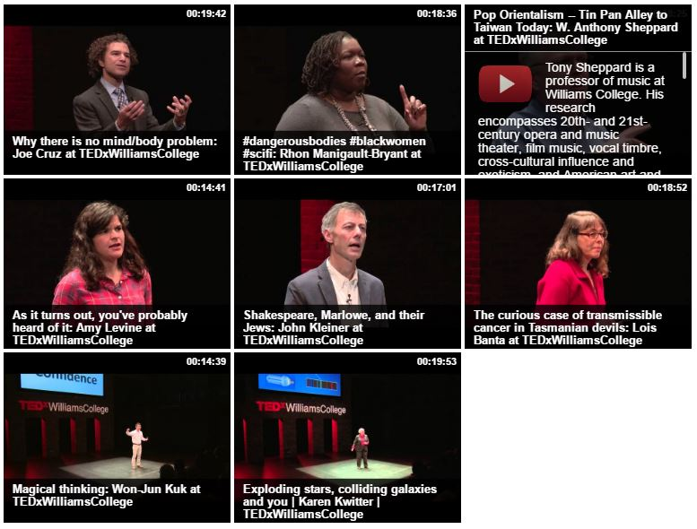

# wp-videowall
A WordPress Widget which displays a 'wall' of YouTube videos from a single playlist, given the YouTube username and password, and the playlist ID. Uses the Google YouTube PHP API, the Isotope/Masonry JS library.

[See the Videowall in the wild.](http://tedx.williams.edu/videos/)

